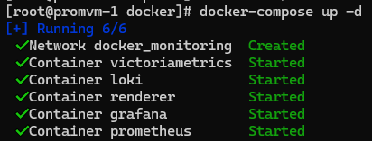

# Описание

Репозиторий для выполнения проектной работы по курсу Observability в Otus

# Тема

Observability кластеров HC Consul, Nomad и их рабочей нагрузки

## Задача

В работе планируется развернуть серверный и клиентский узлы Consul, Nomad. С помощью Nomad запустить простой сайт в Nginx. Настроить мониторинг, логирование и алертинг хостов, сервисов Consul, Nomad и Nginx.

# Решение

## Подготовка инфраструктуры

Инфраструктура состоит из трёх нод:

- hc-server-1 - серверная нода для consul и nomad
- hc-client-1 - клиентская нода для consul и nomad, на ней запущено тестовое приложение
- promvm-1 - для запуска стека мониторинга

В качестве стека мониторинга используются:

- Exporter's - экспортеры метрик
- Prometheus - хранилище метрик
- Victoria Metrics - долговременное хранилище метрик
- Grafana Alloy - агент сбора логов
- Grafana Loki - хранилище логов
- Grafana - визуализация

Для подготовки и конфигурации инфраструктуры Consul, Nomad использовал [Ansible](ansible/site.yml).

Установил Ansible коллекции Prometheus для конфигурирования экспортеров:

 - node_exporter
 - nginx_exporter
 - blackbox_exporter

```shell
ansible-galaxy collection install prometheus.prometheus
```

Создал Ansible роли:

- [consul](ansible/roles/consul)
- [nomad](ansible/roles/nomad)
- [docker](ansible/roles/docker)
- [alloy](ansible/roles/alloy)

Выполнил конфигурацию инфраструктуры Consul, Nomad

```shell
ansible-playbook site.yml -i inventory/hc_cluster.yml -u root -k
```


Тестовый сайт Nginx запущен в номад (через UI)

- [very-important-application.nomad](nomad/very-important-application.nomad)


Стек мониторинга запущен с помощью [Docker](docker/docker-compose.yml)

- [grafana](docker/grafana) - настроена с помощью provisioning
  - [alerting](docker/grafana/provisioning/alerting)
  - [dashboards](docker/grafana/provisioning/dashboards)
  - [datasources](docker/grafana/provisioning/datasources)
- [loki](docker/loki/loki-local-config.yaml)
- [prometheus](docker/prometheus/prometheus.yml)

```shell
docker-compose up -d
```




*Можно было бы развернуть стек в том же Nomad, но выглядит не надёжно запускать 
мониторинг в кластере который в случае падения заберёт его с собой. Предполагается, что стек 
мониторинга разворачивается на отдельных ресурсах.*

## Метрики

Метрики собираются как с помощью отдельных экспортеров (node, nginx, blackbox), 
так и сами приложения Consul, Nomad отдают метрики в формате prometheus.

Цели для метрик в основном определяются через Consul Discovery, дополнительно для
 этого были зарегистрированы сервисы в Consul.

 - [nginx_exporter_service.hcl](ansible/roles/consul/templates/etc/consul.d/nginx_exporter_service.hcl.j2)
 - [node_exporter_service.hcl](ansible/roles/consul/templates/etc/consul.d/node_exporter_service.hcl.j2)


## Логи

С помощью Grafana Alloy организован сбор логов о работе сервисов Consul, Nomad и приложений запущенных в Nomad.

- конфигурация сбора и парсинга логов описана в [config.alloy](ansible/roles/alloy/templates/etc/alloy/config.alloy.j2)


Собранные логи передаются в Grafana Loki и интегрированы в дашборды Grafana соответствующих сервисов.


## Алерты

Настроен алертинг о недоступности сайта Nginx, сервисов Consul, Nomad и повышенной 
утилизации CPU узлов. Доставка уведомлений осуществляется в Telegram.


